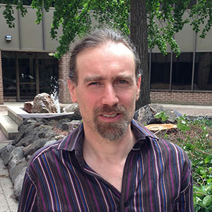

Personnel
=========

Scientists and developers associated with the ELC project

|uhen_pic|

| **Mark D. Uhen**
| PBDB Principal Investigator
| George Mason University

|jenkins_pic|

| **Julian Jenkins**
| ELC Lead Developer
| George Mason University

|williams_pic|

| **Jack Williams**
| Neotoma Principal Investigator    
| University of Wisconsin, Madison

|peters_pic|

| **Shanan Peters**
| PBDB Principal Investigator
| University of Wisconsin, Madison

|goring_pic|

| **Simon Goring**
| Neotoma Developer and PI    
| University of Wisconsin, Madison

|mcclennen_pic|

| **Michael McClennen**
| PBDB Developer
| University of Wisconsin, Madison

|graham_pic|

| **Russell Graham**
| Neotoma Principal Investigator
| Pennsylvania State University

|blois_pic|

| **Jessica Blois**
| Neotoma Principal Investigator
| Pennsylvania State University

|smith_pic|

| **Alison Smith**
| Neotoma Principal Investigator
| Pennsylvania State University

|davis_pic|

| **Edward Davis**
| Neotoma Principal Investigator
| University of Oregon

.. |blois_pic| image:: _static/Blois.jpg
   :width: 150px

.. |smith_pic| image:: _static/Smith.jpg
   :width: 150px

.. |davis_pic| image:: _static/Davis.jpg
   :width: 150px
